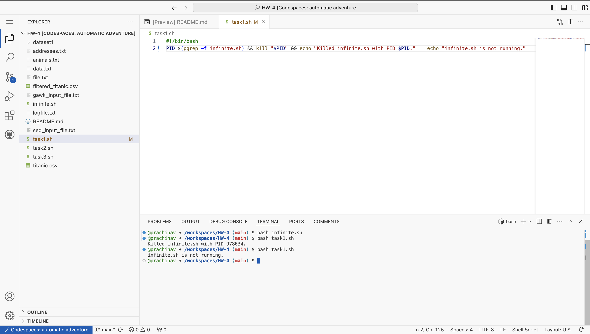
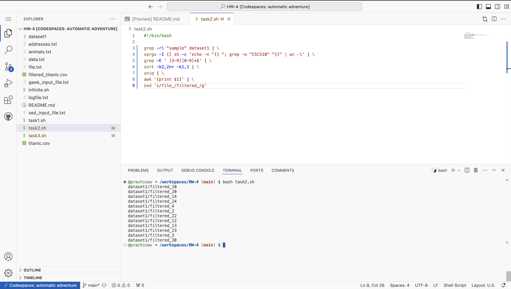
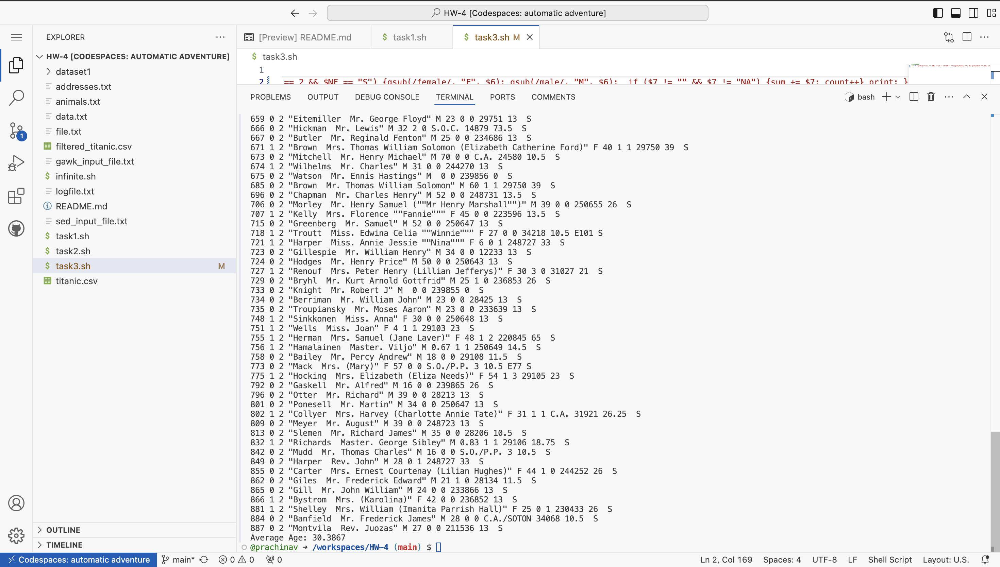

# CSC 510 Software Engineering
## HW-4 

## Group 95 Members:
 
1. Prachi Madhukar Navale
2. Mayur Prakash Gotmare
3. Sidharrth Sudeish Gandhi

## Tasks Overview

### Task 1: Kill Infinite Process
- **Script**: [`task1.sh`](/task1.sh)
- **Description**: Kills the `infinite.sh` process running in the background.
- **Output**:

### Task 2: Filter and Sort Files
- **Script**: [`task2.sh`](/task2.sh)
- **Description**: Lists files containing the word "sample" and at least 3 occurrences of "CSC510", sorts them, and renames them.
- **Output**:

### Task 3: Analyze Titanic Dataset
- **Script**: [`task3.sh`](/task3.sh)
- **Description**: Extracts 2nd class passengers who embarked at Southampton, replaces gender labels, and calculates the average age.
- **Output**:

- **Additional File**: `filtered_titanic.csv` contains the filtered list of passengers.